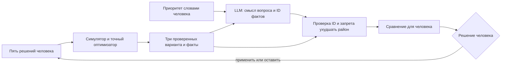

# Аким на 5 часов

Рабочий AI-симулятор пяти бюджетных решений для пяти условных районов Астаны. Пользователь получает одинаковые исходные показатели и бюджет **100**, исследует интерактивную перспективную 3D-схему города, выбирает ровно пять разных мероприятий M1–M14 и видит рассчитанные изменения районов, итоговый **Astana Quality of Life Score**, диаграммы и объяснение последствий. Схема показывает условные районы и их показатели, а не реальные географические границы.

## Запуск

Нужен **Python 3.10+** и современный браузер. Числовой расчёт, интерфейс и сравнение планов используют стандартную библиотеку Python; `pip install` и сетевой доступ для основного сценария не нужны. Финальный код `f6f14f8` проверен на Python 3.12.1 из чистой копии; результаты указаны ниже. Для ответа внешней AI-модели нужен доступ к выбранному провайдеру; NVIDIA дополнительно требует Python SDK `openai`.

```bash
git clone https://github.com/BAITC-Hacks/hack-6775166e-lossless.git
cd hack-6775166e-lossless
python3 src/server.py
```

Откройте **http://127.0.0.1:8000/**. Для другого порта: `PORT=8080 python3 src/server.py`. Сервер доступен только на `127.0.0.1`; для локальной проверки учётная запись не нужна. Остановить — `Ctrl+C`.

### Проверка за минуту

На первом экране нажмите **«Показать проверочный сценарий»**. Кнопка загружает пять мер из датасета и отправляет их через обычную проверку сервера. В итоговом докладе сразу видны стоимость **95**, исходный Score **52,56** и итоговый **56,54**. Нажмите **«Улучшить одно распоряжение»**: замена M5/Сарыарка на M3/Нура повышает Score до **57,21**, но снижает районный балл Сарыарки примерно на **1,21**. Чтобы увидеть другой набор, вернитесь к ручному выбору всех 14 мер.

Это работает без API-ключа: текст помечен как разбор по рассчитанным фактам. Для живого AI-ответа настройте локальный `.env` по разделу ниже и перезапустите сервер. В `.env.example` уже указана проверенная командой модель `gpt-4o-mini`. Ключ не нужен для вычисления Score и не передаётся в браузерную форму.

### AI-объяснение

Если `.env` ещё нет, создайте его по `.env.example` в корне текущего клона; существующий файл сохраните. Заполните `OPENAI_API_KEY` и `OPENAI_MODEL` для [OpenAI Responses API](https://developers.openai.com/api/docs/guides/text) либо `NVIDIA_API_KEY` и точный ID в `NVIDIA_MODEL` из [NVIDIA API Catalog](https://docs.api.nvidia.com/nim/re/reference/llm-apis). Приложение автоматически читает только эти четыре настройки из `.env` текущего клона. Переменные процесса имеют приоритет, даже если заданы пустыми. Файл `.env` исключён из Git; `PORT` задаётся только в командной строке.

OpenAI работает через стандартную библиотеку Python. Для NVIDIA установите необязательную зависимость: `python3 -m pip install -r requirements-model.txt`. При двух настроенных провайдерах приложение выбирает NVIDIA. Чтобы явно запустить приложение с OpenAI:

```bash
NVIDIA_API_KEY= NVIDIA_MODEL= python3 src/server.py
```

Модель получает проверенные расчёты: дельты районов и показателей, вклад мер, синергии и Score; для совета по одной замене — оба расчёта. Она выбирает ID только из фактов, построенных симулятором, для разделов «сильные стороны», «риски» и «компромиссы». OpenAI использует строгую JSON-схему Responses API; результат любого провайдера дополнительно проверяется приложением. Модель не меняет Score и не добавляет собственные числа. Таймаут сетевой операции OpenAI — 20 секунд, чтобы учесть первый запрос с новой JSON-схемой; NVIDIA — 45 секунд. Повторных запросов и автоматического переключения на другого провайдера при ошибке нет. Интерфейс ожидает расчёт и объяснение до 75 секунд. Это не гарантия полного времени ответа: к сетевому вызову добавляется расчёт плана.

При отсутствии ключа или сбое API приложение показывает объяснение из вычисленных фактов с соответствующей пометкой. Основной сценарий доступен эксперту без личного ключа участника. В предыдущем интеграционном кандидате через интерфейс подтверждены настоящие OpenAI-ответы `gpt-5.6-sol` для контрольного плана, одной замены и глобального оптимума; отдельно проверен запуск чистой копии коммита `58d5c11`. В релизной ветке команды `agent/jury-release` подтверждён `gpt-4o-mini` для одного плана, сравнения и вопроса советнику. Протоколы — в [журнале AI-интеграции](docs/model-run-issue.md) и [проверке релизной ветки](docs/model-verification.md). Финальный код `f6f14f8`, включающий ограничение допустимых вариантов советника из `main` (`08bb00e`), проверен из чистой копии; результаты приведены в конце README. Успешный сквозной NVIDIA-прогон пока не подтверждён.

Проверьте настройки без API-запроса, затем выполните два живых контрольных вызова:

```bash
python3 scripts/check-model.py --provider openai --check-config
python3 scripts/check-model.py --provider openai --scenario both
```

Первая команда проверяет только наличие настроек. Вторая проверяет объяснение плана и сравнение; для каждого результата успех означает `source: model`, а при `source: computed_facts` код выхода равен 2. Команды не выводят ключ. В выводе есть провайдер, модель, задержка, время проверки и безопасный код ошибки. Для NVIDIA используйте `--provider nvidia`; без аргументов скрипт проверяет один план и выбирает настроенного провайдера с приоритетом NVIDIA.

Проверка совета по приоритету человека выполняет ещё один живой запрос:

```bash
NVIDIA_API_KEY= NVIDIA_MODEL= python3 scripts/check-model-advice.py
```


## Проверка через интерфейс

1. Откройте приложение «Пять распоряжений»: на первом экране видны условная 3D-схема пяти районов, исходный Score **52,56**, счётчик **0 / 5** и бюджет **0 / 100**. Нажмите на Нуру на схеме или в списке районов: панель покажет исходные слабые показатели **35** и **38**. Кнопка «Меры для района Нура» переведёт к подходящим мерам; «Все 14 мер» откроет полный каталог пяти направлений.
2. Соберите M7/Нура, M8/Нура, M10/Нура, M12/город, M5/Сарыарка. На компьютере перетащите меру за карточку или ручку из девяти точек на район 3D-схемы, плашку охвата или цель на появившейся панели внизу экрана. На телефоне тяните за крупную ручку. Городскую меру направьте на «Весь город». Кнопка «Направить меру» и короткое нажатие на ручку открывают обычный диалог выбора района, доступный также с клавиатуры. Недопустимая цель подсвечивается янтарным и показывает причину, не добавляя меру. Панель пакета показывает охват, число решений и бюджет. Нажмите «Подписать распоряжения». Стоимость **95**, итоговый Score **56,54** (внутреннее значение `56.54307`), показаны районные изменения, диаграммы и синергия M10 + M12. На схеме можно переключать «Было» и «Стало», выбирая район для сравнения.
3. Нажмите «Улучшить одно распоряжение». Лучший допустимый соседний план меняет M5/Сарыарка на M3/Нура: стоимость **100**, Score **57,20556** (на экране 57,21), прирост **0,66249**. Сравнение показывает выигрыш Нуры и снижение районного балла Сарыарки; совет поясняет цену замены. Нажмите «Оставить свой», чтобы сохранить контрольный пакет. «Применить план» перенесёт замену в пакет для проверки и нового подписания.
4. Нажмите «Сравнить с оптимумом». Точный оптимизатор покажет рядом ваш план и M2/город, M3/Нура, M8/Нура, M9/Нура, M14/город: стоимость **98**, Score **57,236735** (на экране 57,24). Это максимум **заданной математической модели** среди допустимых планов, а не доказательство лучшей реальной городской политики. Таблица показывает баллы районов и разницу между планами, включая Сарыарку, которой ручной вариант полезнее. Здесь же показано объяснение оптимального плана с пометкой источника: модель или вычисленные факты. «Оставить свой» сохраняет пакет; «Применить план» переносит рекомендацию для проверки и подписания. Сам поиск оптимума занимает около 4 секунд на компьютере команды и кэшируется в процессе сервера. При настроенной модели каждый запрос также получает объяснение через API, поэтому полное время может быть больше.
5. Для проверки ограничений нажмите «Пересмотреть решения»: выбранную меру нельзя добавить повторно. Третья мера одного направления, превышение бюджета и несовместимые меры показывают причину и блокируют добавление. При пяти решениях можно заменить одно; неполный пакет нельзя подписать. Изменение пакета делает прежний итог недоступным. Сервер независимо проверяет все ограничения и не возвращает Score для невалидного набора.

Схему можно вращать перетаскиванием свободного места, приближать кнопками и клавиатурой; колёсико меняет масштаб с зажатым `Ctrl` или `⌘`. На телефоне выбор района доступен также через список под схемой. Если браузер не поддерживает Canvas, остаётся список районов и панель целей для перетаскивания; при настройке сниженного движения анимация ограничена. Score остаётся исходным до подписания полного валидного пакета.

## Вопрос советнику

После расчёта плана можно спросить, какой компромисс важен для человека, например: «Почему рекомендация ухудшает Сарыарку?». `POST /api/advice` сравнивает ваш план, лучшую допустимую замену одного решения и глобальный оптимум **заданной модели**. Сервер рассчитывает и проверяет все три варианта независимо от текста вопроса. При настроенном API-ключе LLM интерпретирует вопрос и выбирает вариант для обсуждения и ID значимых проверенных фактов; сервер собирает текст из этих фактов, не показывая свободный текст модели. Человек решает, какой вариант принять. Без доступной модели ответ помечен `source: computed_facts`, а `selected_option: none` означает отсутствие модельного совета.



Проверка API при запущенном сервере:

```bash
curl -sS http://127.0.0.1:8000/api/advice \
  -H 'Content-Type: application/json' \
  --data '{"decisions":[{"measure_id":"M7","district":"Нура"},{"measure_id":"M8","district":"Нура"},{"measure_id":"M10","district":"Нура"},{"measure_id":"M12","district":null},{"measure_id":"M5","district":"Сарыарка"}],"question":"Почему рекомендация ухудшает Сарыарку?"}'
```

В ответе `options` содержит `current`, `one_change`, `optimum` с проверенными результатами, решениями и компромиссами; `advice` содержит текст, источник (`model` либо `computed_facts`) и `selected_option`. Для этого примера Score вариантов — `56.54307`, `57.20556` и `57.236735`. При замене одного решения балл Нуры растёт на `2.02`, а Сарыарки снижается на `1.2125`. `selected_option` показывает выбранный моделью вариант для обсуждения либо `none`, если модель не выбрала вариант или недоступна; это поле не изменяет результаты расчёта.

## Короткий показ для жюри

Ручной план за 95 повышает Score с **52,56** до **56,54** и улучшает Сарыарку, но Нура остаётся районом с самым низким баллом. Замена одной меры поднимает Score до **57,21** и помогает Нуре ценой меньшего эффекта в Сарыарке. Глобальный перебор даёт **57,24** при бюджете 98. Спросите советника, почему план с большим Score может быть хуже для Сарыарки: он покажет рассчитанный компромисс и поможет человеку выбрать приоритет. Все три значения вычислены по формуле синтетической задачи; AI объясняет уже рассчитанные изменения и не служит числовым калькулятором.

Сервер проверяет ровно пять уникальных мер, максимум две меры каждого направления, район для районной меры, отсутствие района для городской, бюджет и конфликты. Эффекты учитывают лаг, синергии и ограничение 0–100. Score вычисляется по формуле датасета после всех изменений; остаток бюджета бонуса не даёт, порядок мер не влияет на результат.

## Автоматические проверки

На чистой копии финального кода `f6f14f8` 23 сентября: **66 тестов прошли за 37,478 с** на Python **3.12.1**; синтаксис JavaScript проверен. Быстрый сценарий через интерфейс дал **Score 56,54**, стоимость **95** и резервное объяснение `computed_facts` без ключа. С настроенной моделью проверены четыре сценария OpenAI `gpt-5.6-sol`: ручной план **56,54 / 95**, одна замена **57,21 / 100**, глобальный оптимум **57,24 / 98** и совет по трём рассчитанным вариантам. После последнего объединения живой вопрос «Не хочу ухудшать Сарыарку» выбрал исходный план **56,54**, показав потери альтернатив **1,21** и **0,53** балла Сарыарки. Протокол — в [журнале AI-интеграции](docs/model-run-issue.md).

```bash
python3 -m unittest discover -s tests -v
python3 benchmark/optimizer_benchmark.py --self-test
python3 benchmark/optimizer_benchmark.py --scenario official --oracle
python3 benchmark/optimizer_benchmark.py --scenario official --oracle --optimizer python3 src/optimizer.py
python3 benchmark/london_ward_benchmark.py --oracle --optimizer python3 src/optimizer.py > /tmp/london-result.json
```

Тесты проверяют исходный Score **52.55768**, контрольный Score **56.54307**, ошибки валидации, синергии, независимость от порядка и границы объяснения. Benchmark использует отдельную реализацию формулы и точный перебор; на официальных данных максимум по модели — **57.236735** среди **694395** допустимых портфелей. Независимый оптимизатор `src/optimizer.py` совпал с oracle на официальном и трёх синтетических сценариях: `regret = 0`, около 4 секунд против около 12 секунд у oracle на компьютере команды. Случайный поиск с тем же бюджетом времени тоже нашёл максимум в этих четырёх случаях, поэтому подтверждённое преимущество оптимизатора — гарантия точного ответа, а не более высокий Score. В `docs/benchmark-data.md` описаны воспроизводимые стресс-сценарии с seed `20260923` и условия сравнения. Синтетика не заменяет официальные пять районов в приложении.

## Ограничения и происхождение

Числа, эффекты мер и формула взяты из двух исходных DOCX в `task/`; датасет задачи синтетический. Это симуляция по заданной модели, а не прогноз реальных социальных последствий. Лицензия на публикацию DOCX отдельно не указана; репозиторий команды приватный. Отдельный benchmark использует официальный открытый CSV London Ward Profiles по лицензии OGL v2: исходные строки, SHA, нормировка и ограничения описаны в `docs/benchmark-data.md`. На пяти лондонских ward оптимизатор совпал с независимым oracle (`regret = 0`), но показатели там служат техническими proxy, а эффекты мер остаются искусственными. В официальный Score Астаны лондонские данные не подставляются. Источники NYC и OECD пока каталогизированы, данные из них не включены.

Основной рантайм и интерфейс, включая перспективную 3D-схему на Canvas, написаны для этой задачи на стандартных Python, HTML, CSS и JavaScript. Необязательный NVIDIA-клиент использует сторонний `openai` Python SDK 3.16.2 (Apache-2.0) через совместимый API; версия зафиксирована в `requirements-model.txt`. До старта задачи в репозитории существовали инфраструктурные скрипты и рабочие инструкции; их роль описана в `docs/parallel-agents.md`. Код из исследовательского репозитория `gentle_precision` в приложение не переносился.

Документы проекта: [сводка ТЗ](docs/task-requirements.md), [контракты модулей](docs/contracts.md), [схема визуализации](docs/visualization.md), [независимый разбор MVP](docs/critic-review.md), [порядок сдачи](docs/submission.md).

## Проверка финального кода

23 сентября 2026: чистая копия отслеживаемых файлов коммита `f6f14f8`, созданная через `git archive` без `.env` и `.venv`, проверена на Python 3.12.1. Команда `python3 -m unittest discover -s tests -q` завершилась с **66 тестами, OK**, за **37,478 с**. Запуск по README с отдельным портом `PORT=36885 python3 src/server.py` успешен; браузерный быстрый сценарий показал **56,54 / 95** и `source: computed_facts`, как ожидается без ключа.

Финальный код включает изменения `main` до `08bb00e`, в том числе ограничение допустимых вариантов советника. После объединения проверен живой OpenAI-совет с запретом ухудшать Сарыарку: `source: model`, выбран исходный план, показаны рассчитанные потери альтернатив. Ранее в объединённом интерфейсе подтверждены все четыре модельных сценария и показ объяснения глобального оптимума. Подробности и ограничения — в [протоколе проверки](docs/model-run-issue.md).
