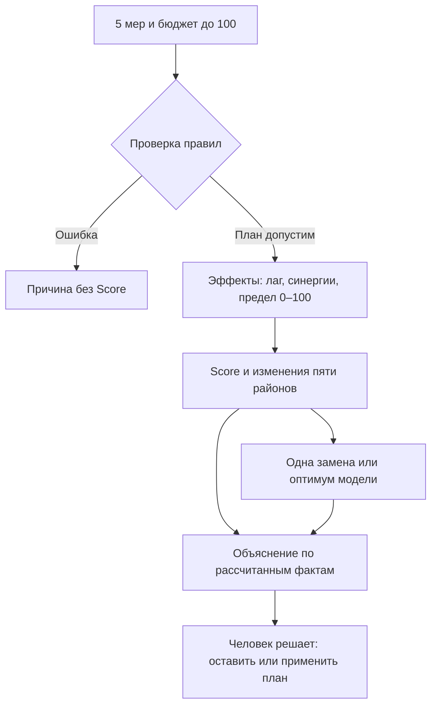

# Аким на 5 часов

**Симулятор городских решений:** распределите бюджет **100** между пятью мерами для пяти условных районов Астаны и посмотрите, как изменится качество жизни по формуле задачи. Исследуйте условную 3D-схему города, перетаскивайте меры на районы и сравнивайте результаты с лучшей заменой одного решения и оптимумом модели. AI-советник помогает разобрать компромиссы.

Данные районов синтетические. Интерактивная 3D-схема помогает сравнивать показатели, но не показывает реальные границы города.

## Запуск за 30 секунд

- Нужны **Python 3.10+**, современный браузер и доступ к репозиторию.
- Для основного сценария **не нужны** `pip install`, API-ключ или интернет после получения кода.

```bash
git clone https://github.com/BAITC-Hacks/hack-6775166e-lossless.git
cd hack-6775166e-lossless
python3 src/server.py
```

Откройте **http://127.0.0.1:8000/**. Остановить сервер: `Ctrl+C`. Если порт занят: `PORT=8080 python3 src/server.py` и откройте порт 8080.

## Проверка за минуту

1. На первом экране нажмите **«Показать проверочный сценарий»**.
2. В отчёте проверьте стоимость **95**, исходный Score **52,56** и новый **56,54**. Сравните районы и источник объяснения.
3. Нажмите **«Проверить одну замену»**, затем **«Сравнить с оптимумом»**. Оба варианта предлагаются для сравнения; применить их можно только своим решением.

| План | Бюджет | Score на экране | Что меняется |
| --- | ---: | ---: | --- |
| Исходное состояние | 0 / 100 | **52,56** | Одинаково для всех пользователей |
| Проверочный: M7, M8, M10 → Нура; M12 → город; M5 → Сарыарка | 95 / 100 | **56,54** | Синергия M10 + M12 |
| Одна замена: M5/Сарыарка → M3/Нура | 100 / 100 | **57,21** | Нура выигрывает, Сарыарка теряет около 1,21 балла |
| Оптимум заданной модели | 98 / 100 | **57,24** | M2/город, M3/Нура, M8/Нура, M9/Нура, M14/город |

Точные значения для автоматической проверки: **52.55768**, **56.54307**, **57.20556**, **57.236735** соответственно. Большее значение в симуляторе не означает доказанную пользу для реального города.

## Соберите свой план

- Выберите **ровно пять разных мер** M1–M14 из пяти направлений. Нажмите **«Все 14 мер»**, чтобы открыть каталог.
- Укажите район для районной меры; для городской выберите **«Весь город»**. Карточку можно перетащить на район 3D-схемы или на подписанные цели **«Назначить на территорию»** рядом с каталогом. На телефоне цели остаются над карточками при прокрутке. Короткое нажатие на ручку карточки или кнопка **«Выбрать меру»** открывают выбор района с клавиатуры.
- Нажмите **«Рассчитать результат»**. Отчёт покажет Score, изменения районов, диаграммы, синергии и объяснение. На схеме переключайте **«Было» / «Стало»**. Выбранные меры представлены условными 3D-моделями на городской сцене; отдельную меру можно рассмотреть в поворачиваемой мини-сцене.
- Сервер отклоняет повтор меры, третью меру одного направления, неверный район, стоимость выше 100 и несовместимые сочетания. Причина видна пользователю; **для невалидного плана Score отсутствует**.



Score считает только симулятор по формуле датасета. Порядок пяти мер не влияет на результат, остаток бюджета не даёт бонуса. Полная формула и ограничения — в [сводке ТЗ](docs/task-requirements.md).

## Спросите советника

После расчёта задайте вопрос, например **«Почему рекомендация ухудшает Сарыарку?»** Советник сопоставит ваш план, лучшую допустимую замену одного решения и глобальный оптимум **заданной модели**.

Проверять живую модель нужно в сервере, запущенном **из того же клона, где лежит ваш `.env`**. Если интерфейс открыт на другом порту или из отдельного worktree без этого файла, там работает только разбор по вычисленным фактам. После изменения `.env` перезапустите процесс `python3 src/server.py` и обновите страницу. Успех живого запроса виден по метке **«AI-разбор проверенных расчётов»**; метка **«Разбор по рассчитанным фактам»** означает, что ответ модели не получен. Три числовых варианта в обоих случаях считает симулятор.

- При доступной LLM вопрос помогает выбрать вариант для обсуждения и значимые **проверенные факты**. Модель не считает Score и не меняет планы.
- Без модели приложение показывает разбор по вычисленным фактам с пометкой `computed_facts`; выбор совета обозначен `none`.
- Решение применить предложенный план остаётся за вами. Формат `/api/simulate` и `/api/advice` с примером JSON описан в [контрактах API](docs/contracts.md).

## Подключить живое AI-объяснение — необязательно

Основной сценарий работает без ключа. Если нужен ответ модели:

1. Если локального `.env` ещё нет, создайте его из [образца](.env.example): `cp .env.example .env`.
2. Заполните **одну** пару настроек:

   | Провайдер | Переменные в `.env` | Дополнительный шаг |
   | --- | --- | --- |
   | [OpenAI API](https://developers.openai.com/api/docs/guides/text) | `OPENAI_API_KEY`, `OPENAI_MODEL` | Не нужен; пример ID модели — `gpt-4o-mini` |
   | [NVIDIA API Catalog](https://docs.api.nvidia.com/nim/re/reference/llm-apis) | `NVIDIA_API_KEY`, `NVIDIA_MODEL` | `python3 -m pip install -r requirements-model.txt` |

3. Перезапустите `python3 src/server.py` и повторите проверочный сценарий. Метка **`model`** означает реальный ответ API; **`computed_facts`** — резервное объяснение при отсутствии ключа или ошибке.

- Настройки читаются из `.env` текущего клона. Переменные процесса имеют приоритет, **включая пустые**. Если заданы оба провайдера, выбирается NVIDIA. Для явного выбора OpenAI: `NVIDIA_API_KEY= NVIDIA_MODEL= python3 src/server.py`.
- Для живого ответа нужен ваш разрешённый ключ провайдера; проект не выдаёт тестовые ключи.
- Ключи не вводятся в браузере и не должны попадать в Git. `.env` уже исключён из репозитория.
- Сетевые таймауты: OpenAI — 20 с, NVIDIA — 45 с; интерфейс ждёт расчёт и объяснение до 75 с. При ошибке автоматического переключения провайдера нет.

Проверка настроек без API-запроса, затем объяснения плана, сравнения и совета:

```bash
python3 scripts/check-model.py --check-config
python3 scripts/check-model.py --scenario both
python3 scripts/check-model-advice.py
```

Скрипты следуют тому же приоритету провайдеров, что приложение. Для проверки конкретного провайдера добавьте `--provider openai` или `--provider nvidia` к первым двум командам; советника с OpenAI при настроенной NVIDIA запустите как `NVIDIA_API_KEY= NVIDIA_MODEL= python3 scripts/check-model-advice.py`. Живая проверка успешна только при `source: model`; резервный ответ даёт код выхода 2. Скрипты не печатают ключи. Фактические прогоны и ограничения — в [журнале интеграции](docs/model-run-issue.md) и [проверке модели](docs/model-verification.md).

## Автоматическая проверка

```bash
python3 -m unittest discover -s tests -q
python3 benchmark/optimizer_benchmark.py --scenario official --oracle --optimizer python3 src/optimizer.py
```

- Тесты проверяют базовый и контрольный Score, ошибки валидации, лаг, синергии, независимость от порядка, оптимизатор и объяснение.
- Второй шаг сравнивает оптимизатор с независимым точным перебором: на официальных данных ожидается максимум **57.236735**. Дополнительные сценарии и команды — в [описании benchmark](docs/benchmark-data.md).
- Для ручной проверки пройдите сценарий «Проверка за минуту» выше: он использует обычную серверную валидацию.

## Данные, компоненты и ограничения

- **Источник чисел:** два документа в `task/` — ТЗ и синтетический датасет районов. Права на их публикацию отдельно не указаны; командный репозиторий приватный.
- **Реализация:** Python, HTML, CSS, JavaScript и Canvas, включая 14 условных 3D-моделей мер, написаны для этой задачи. Светлая гамма восстановлена из исходного интерфейса команды; официальный бренд и логотип Astana Hub не используются. До старта в репозитории были инфраструктурные скрипты и рабочие инструкции; состав описан в [плане команды](docs/parallel-agents.md).
- **Необязательная библиотека:** для NVIDIA используется `openai==3.16.2` (Apache-2.0) через совместимый API. OpenAI Responses API вызывается средствами стандартной библиотеки Python.
- **Отдельный benchmark:** использует открытый London Ward Profiles (OGL v2) как технический тест оптимизатора; его данные **не входят** в Score Астаны. Происхождение и нормировка — в [описании benchmark](docs/benchmark-data.md).
- **Границы результата:** это симуляция по заданной формуле, не прогноз реальных эффектов. Успешный сквозной NVIDIA-прогон пока не подтверждён. Без доступной модели объяснение строится из вычисленных фактов и явно помечается.

Для деталей: [контракты модулей](docs/contracts.md), [визуализация](docs/visualization.md), [порядок сдачи](docs/submission.md).
