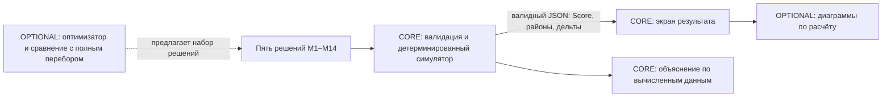

# Визуализация результата

`web/charts.js` экспортирует `window.renderDistrictCharts(container, result)` для `#district-chart`; `web/charts.css` оформляет диаграммы. Оба файла не требуют сборки и сторонних библиотек. Модуль показывает состав формулы Score (`0,7 × средневзвешенный районный балл + 0,3 × худший район − число критических показателей`), итоговые баллы пяти районов и три наибольших ненулевых изменения показателей в каждом районе. Все числа взяты из валидного ответа `src/simulator.py`; исходный районный балл здесь не изображается, так как ответ симуляции его не содержит. Ошибочный набор не визуализируется.

Диаграммы — дополнительный способ прочитать уже рассчитанный результат. Оптимизатор на схеме помечен `OPTIONAL`: эта визуализация не доказывает, что он реализован или улучшает Score. Для демонстрации сценария нужен запрос с пятью допустимыми решениями и проверка ответа сервера.

## Интерактивная схема города

Файлы web/city3d.js и web/city3d.css добавляют самостоятельную условную 3D-схему пяти районов без сторонних библиотек. Перспективная проекция, объёмные платформы и здания отрисованы в Canvas; пользователь вращает и наклоняет сцену перетаскиванием, приближает кнопками или колёсиком с Ctrl/Command, нажимает на район на самой сцене либо выбирает его отдельной кнопкой. Обычная прокрутка страницы остаётся доступной. Кнопки доступны через Tab, Enter/Space и стрелки; мобильная версия показывает их в статичной сетке под сценой. При отказе Canvas кнопки остаются. При системной настройке уменьшения движения вступительная анимация отключена.

Компонент монтируется вызовом window.createCityScene(container, { onSelect }); возвращённый объект имеет update({ districts, selected, affected, resultDistricts, mode }) и destroy(). districts — исходный объект каталога. resultDistricts можно передать только из валидного результата симулятора; тогда mode: result показывает предоставленные сервером районные баллы. affected подсвечивает только охват выбранной меры. Схема не рассчитывает ни районный, ни городской Score и не изображает точную географию. Высота и количество декоративных зданий постоянны и не кодируют реальные население, плотность застройки или показатели района.

Самый низкий из уже предоставленных районных баллов отмечен оранжевым акцентом и словом «МИНИМУМ»; это сравнение готовых чисел, а не самостоятельный расчёт Score. Зелёный обозначает выбранный район, оранжевый — охват подсвеченной меры. На узком экране вертикальный свайп по холсту продолжает прокручивать страницу; вращение доступно горизонтальным жестом, наклон — кнопками.

## Перетаскивание мер на сцену

Объект сцены дополнительно предоставляет pickDistrict(clientX, clientY): string|null и setDropPreview(name|null): void. Координаты pickDistrict заданы относительно окна браузера, как у PointerEvent.clientX/clientY; метод учитывает прокрутку страницы, размер холста, текущий поворот и масштаб. Сначала проверяются видимые кнопки районов, затем объёмные здания и платформы Canvas. Если Canvas недоступен, кнопки районов продолжают работать как цели. За пределами схемы метод возвращает null.

setDropPreview показывает временную цель перетаскивания оттенком lime из текущей темы и подсказкой «Отпустите меру», но не выбирает район и не изменяет данные или Score. Неизвестное имя и null снимают подсветку. После подтверждённого drop интерфейс сам добавляет меру в пакет и вызывает update с актуальным выбранным районом.

## Условные 3D-модели инициатив

`createCityScene` принимает дополнительные поля `update({..., decisions, measures})`: `decisions` — текущие решения в формате `{measure_id, district}`, `measures` — словарь каталога M1–M14. Каждое решение изображается на условной платформе района; городские M2, M6, M12 и M14 стоят на общей кромке схемы и соединены декоративными линиями со всеми пятью районами. Геометрия не изображает место строительства или величину эффекта. В режиме `baseline` это наглядный **проект пакета**; в режиме `result` после валидного ответа симулятора те же модели становятся заполненными, показывая решения, вошедшие в расчёт, а не физическое завершение проектов. Под сценой есть подписанный список мер, который остаётся доступным при отсутствии Canvas.

Для drag preview компонент предоставляет `setInitiativePreview({measureId, district}|null)`. Название района нужно для районной меры, `district:null` — для городской. Временная модель и строка «Предпросмотр» не добавляют меру в пакет и не меняют Score. `setDropPreview(name|null)` продолжает отдельно показывать допустимую цель перетаскивания. После drop интерфейс очищает оба предпросмотра и вызывает `update` с новым пакетом.

`window.createInitiativeDiorama(container)` создаёт компактную сцену одной меры для sticky панели планировщика и возвращает `update({measure, district, mode})` и `destroy()`. `measure` — объект каталога с `id`, `name`, `scope` или `null`; `mode` — `preview`, `plan` либо `result`. Диорама масштабируется под высоту контейнера от 118 px, допускает горизонтальный поворот перетаскиванием и клавишами ←/→, а на узком экране сохраняет вертикальную прокрутку страницы. Без Canvas название и состояние меры остаются видимыми.

Четырнадцать мотивов различаются по форме: автобусная полоса, светофор, пути ЛРТ, деревья парка, модуль чистого топлива, ветрозащитная посадка, пара корпусов школы и детсада, медицинский крест, спортплощадка, фонари и камеры, безопасный переход, цифровой портал, инженерные сети и машина аварийной бригады. Это пиктограммы в 3D, а не конкретные городские объекты. Сцена использует исходную светлую палитру Егора: paper, panel, green, lime и orange. Числовые значения, география, высота/количество реальных объектов и фактическая реализация мер из этих моделей не выводятся.
