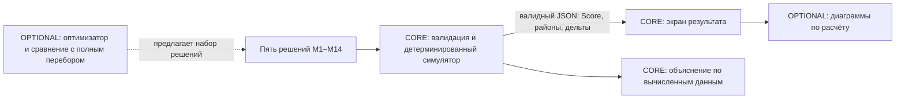

# Визуализация результата

`web/charts.js` экспортирует `window.renderDistrictCharts(container, result)` для `#district-chart`; `web/charts.css` оформляет диаграммы. Оба файла не требуют сборки и сторонних библиотек. Модуль показывает состав формулы Score (`0,7 × средневзвешенный районный балл + 0,3 × худший район − число критических показателей`), итоговые баллы пяти районов и три наибольших ненулевых изменения показателей в каждом районе. Все числа взяты из валидного ответа `src/simulator.py`; исходный районный балл здесь не изображается, так как ответ симуляции его не содержит. Ошибочный набор не визуализируется.

Диаграммы — дополнительный способ прочитать уже рассчитанный результат. Оптимизатор на схеме помечен `OPTIONAL`: эта визуализация не доказывает, что он реализован или улучшает Score. Для демонстрации сценария нужен запрос с пятью допустимыми решениями и проверка ответа сервера.
